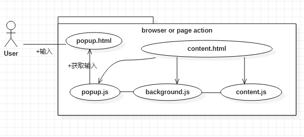
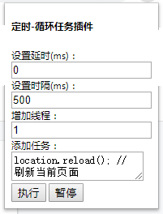

## chrome extension：页面定时任务插件

- 插件功能介绍


- 插件工作流程



其中popup.html的内容如下：



插件默认实现的是`每间隔500ms刷新当前页面一次`
```
1.可以设置延时执行和循环执行的时间间隔
2.添加线程则添加多个当前页面
3.任务是可扩展的，添加任务即往当前页面插入的JavaScript代码
```

- 扩展问题
```
1. 如果我只想在一个页面中循环执行而它跳转了，我该怎么办？
2. 如果我想的循环执行的任务是多个关联页面的，我该怎么办？
```

